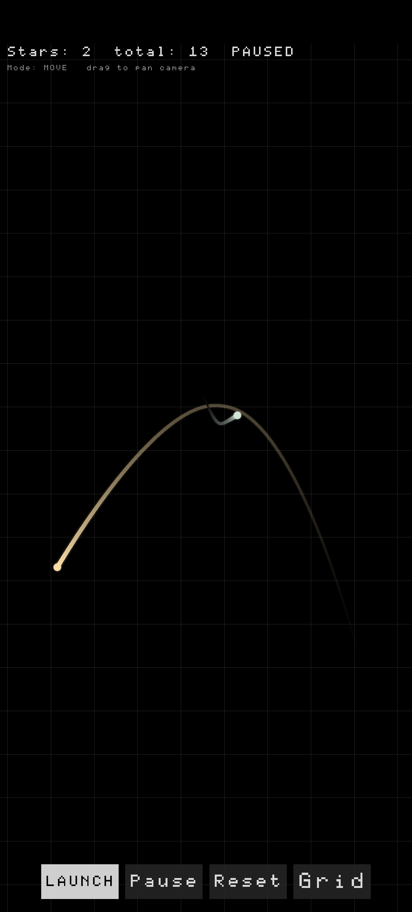
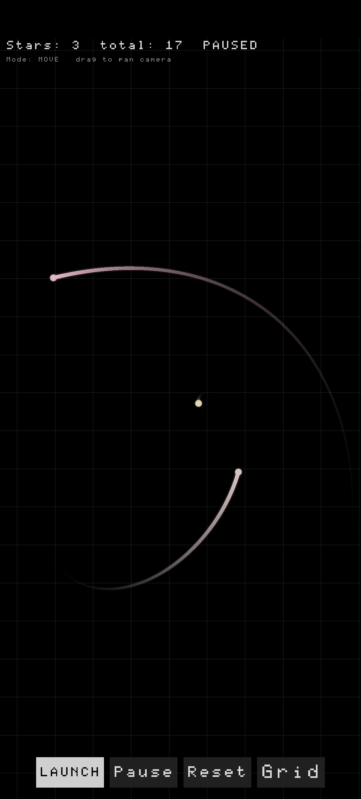

# stars — N-Body Gravity Simulation on Android

Interactive 2D gravitational n-body simulation for Android. Tap to spawn stars that orbit and collide via Newtonian gravity, with glowing trails and color blending on merge.




## Features

- **N-body physics** — RK4 integration with 50 substeps per frame for stable orbits
- **Tap to create** — tap a spot to place a static star, drag to launch a star with velocity
- **Pan mode** — toggle MOVE mode to drag and explore the infinite canvas
- **Star collisions** — inelastic merging with colour blending
- **Glowing trails** — fading ribbons rendered per star
- **Circular particles** — smooth GLES 2.0 shader-based rendering
- **HUD** — star count, total ever created, pause indicator

## Controls

| Button | Action |
|--------|--------|
| **LAUNCH** (default mode) | Tap = static star, Drag = launch with velocity |
| **MOVE** | Drag to pan camera |
| **Pause / Go on** | Toggle simulation |
| **Reset** | Clear all stars and trails |
| **Grid / Hide** | Toggle background grid |

## Build

### Prerequisites

- Android SDK (API 34)
- Android NDK 27+
- CMake 3.28+
- Ninja

### Build release APK

```bash
git clone <repo-url>
cd stars
./gradlew assembleRelease
```

Output: `app/build/outputs/apk/release/app-release.apk`

### Install

```bash
adb install -r app/build/outputs/apk/release/app-release.apk
```

## Tech Stack

- **C++20** — simulation engine
- **OpenGL ES 2.0** — shader-based rendering
- **SDL2** — windowing, input, Android glue
- **GLM** — vector math
- **Gradle + NDK** — Android build system
